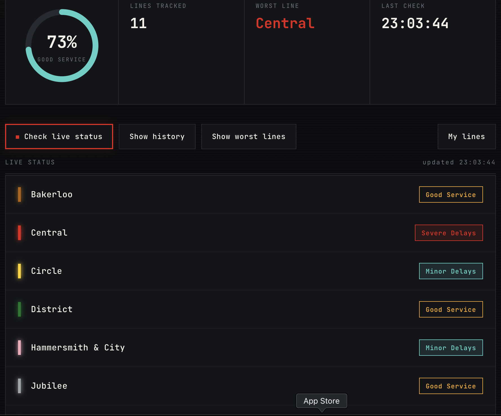
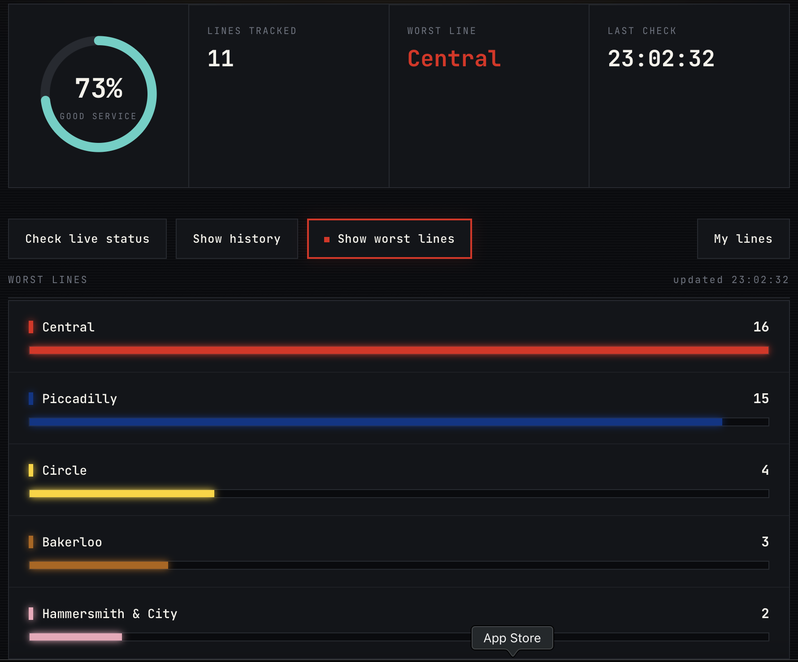
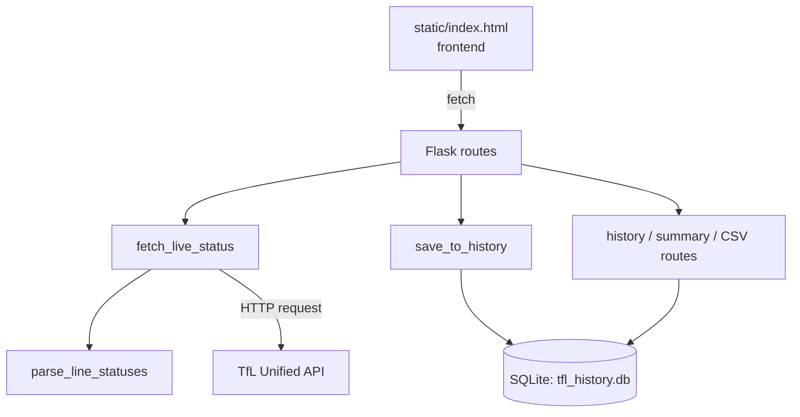
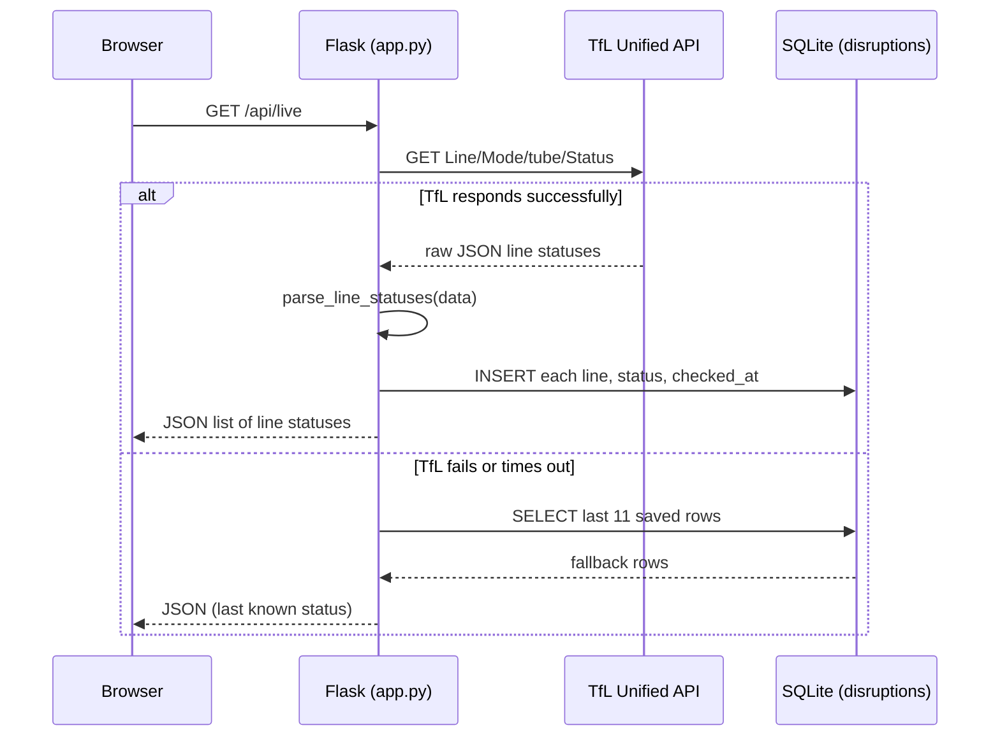

# London Transport Delay Tracker

A Flask app that checks live status for London Tube lines using TFL's
public API, and saves each check to a database so I can build up a
history of delays over time.

I'm building this one small piece at a time and updating this README
as I go, instead of writing it all at once at the end. Partly so I
actually remember why I made each decision, and partly because I want
this file to genuinely show how the project came together.

---

## Screenshots




---

## Tech stack

| Layer | Technology |
|---|---|
| Backend | Python, Flask |
| Database | SQLite |
| Frontend | HTML, CSS, vanilla JavaScript |
| External API | TfL Unified API |
| Testing | pytest |

## Endpoints

| Endpoint | Method | Description |
|---|---|---|
| `/` | GET | Serves the frontend |
| `/api/live` | GET | Fetches live status from TfL, saves it, returns JSON. Falls back to the last saved data if TfL is unreachable |
| `/api/history` | GET | Returns every saved status check as JSON |
| `/api/history/csv` | GET | Downloads all saved history as a CSV file |
| `/api/summary` | GET | Returns a count of non-"Good Service" checks per line |

## Architecture



## Sequence diagram — `/api/live`



## Strengths

- Real integration with an external, live API — not mock or static data
- Persistent history stored in SQLite, building up over time
- Parameterized SQL queries throughout (protection against SQL injection)
- Graceful fallback to last saved data if the TfL API is down or rate-limited
- CSV export for taking data out of the app
- Custom-designed frontend, not a template — built around a departure-board concept using real Tube line colours
- One automated pytest test on the core parsing logic, with a clear path to add more
- Built incrementally with a full day-by-day git history and log (see below)

## Limitations

- `/api/live` only fetches new data when a user visits it — there's no background scheduler polling TfL continuously
- The disruption summary counts are calculated manually in Python rather than with SQL's `GROUP BY`, since that was still outside my SQL knowledge at the time
- Only one automated test exists so far — the database and Flask routes themselves aren't covered yet
- Runs locally only; not yet deployed to a public URL
- Status severity is currently grouped into three broad categories rather than reflecting TfL's full range of status codes

## Project structure
tfl-tracker/
├── app.py Flask routes, TfL fetch, database logic
├── test_app.py pytest suite for the parsing logic
├── static/
│ └── index.html Frontend — departure-board styled dashboard
├── screenshots/ Captures of the running app
├── requirements.txt Runtime dependencies
├── README.md This file, including a day-by-day build log
└── .gitignore

## Getting started

```bash
pip install -r requirements.txt
export TFL_APP_KEY="your-tfl-api-key"   # optional, works without one at low volume
python3 app.py
```

Then open `http://127.0.0.1:5000`.

## Running the tests

```bash
pytest
```

## Future improvements

- Move the disruption summary from manual Python counting to a real
  SQL `GROUP BY` query
- Add a background scheduler (e.g. APScheduler) to poll TfL
  continuously, instead of only on request
- Expand test coverage to the Flask routes and database layer, not
  just the parsing function
- Deploy to a public URL (Render or Railway) instead of running
  locally only
- Add a history chart showing % good service over time per line

## License

MIT — free to use, modify, and learn from.

Data from [Transport for London's Unified API](https://tfl.gov.uk/info-for/open-data-users/), made available under the Open Government Licence.

---

## Log

### Day 1 — it runs

Got the absolute simplest version of this working today: a Flask app
with one route that just says the tracker is running.

```python
from flask import Flask

app = Flask(__name__)

@app.route("/")
def home():
    return "London Transport Delay Tracker is running!"

if __name__ == "__main__":
    app.run(debug=True)
```

**Run it:**
```bash
pip install flask
python app.py
```
Then open `http://127.0.0.1:5000`.

### Day 2 — somewhere to put the data

Added SQLite today so I have somewhere to actually save the status
checks. First time really using it — turns out it's just a file, no
separate server to install, which wasn't what I expected.

Wrote one function, `init_db()`, that creates a table called
`disruptions` if it doesn't already exist. Used `IF NOT EXISTS`
since I call this every time the app starts, and forgot `.commit()`
the first time and couldn't figure out why nothing was saving.

```python
import sqlite3

DB_FILE = "tfl_history.db"

def init_db():
    connection = sqlite3.connect(DB_FILE)
    cursor = connection.cursor()

    cursor.execute("""
        CREATE TABLE IF NOT EXISTS disruptions (
            id INTEGER PRIMARY KEY AUTOINCREMENT,
            line_name TEXT,
            status TEXT,
            checked_at TEXT
        )
    """)

    connection.commit()
    connection.close()
```

### Day 3 — adding real data

Added the actual TFL API call today. This is the first time the app
does something with real, live data instead of placeholder text.

Hit a snag straight away, got a `429 Too Many Requests` error the
first time I ran it, because I was using the placeholder API key.
Turned out TFL's status endpoint works without a real key for light
use, but the rate limit on that is very easy to hit while testing
repeatedly. Registered for a free TFL API key and set it as an
environment variable instead of putting it in the code, so it never
ends up in git history.

```python
def fetch_live_status():
    url = "https://api.tfl.gov.uk/Line/Mode/tube/Status"
    params = {"app_key": TFL_APP_KEY}

    response = requests.get(url, params=params, timeout=10)
    response.raise_for_status()
    data = response.json()

    results = []

    for line in data:
        line_name = line["name"]
        statuses = line["lineStatuses"]
        status = statuses[0]["statusSeverityDescription"]

        one_result = {"line": line_name, "status": status}
        results.append(one_result)

    return results
```

Tested it by temporarily printing the result before committing, and
saw real live line statuses (Bakerloo on Severe Delays, Central on
Minor Delays, etc.) — first time this project actually reflects
something real happening in London right now, which felt like a good
milestone.

### Day 4 — saving data and returning JSON

Connected everything together. Added `save_to_history()`, which
writes each line's status into the database, plus `/api/live` and
`/api/history` — one fetches fresh data and saves it, the other just
reads back what's already stored.

Made sure to use `?` placeholders in the SQL insert instead of
putting values straight into the string, learned that's what stops
SQL injection, so wanted to actually get that instead of just copying
it.

Also added `/api/summary`, which counts how many times each line's
had a bad status. Did the counting with a plain dictionary instead of
SQL's `GROUP BY`, since I don't know that yet, might redo it properly
later.

Tested by hitting `/api/live` a few times, then checking `/api/history`
and `/api/summary` actually reflected it. Core app's working now,
still want to add a real frontend at some point.

### Day 5 — a real frontend

Added `static/index.html` and updated the homepage route to serve it
with `send_from_directory` instead of returning plain text. Styled it
as a departure board, using the real TfL line colours as status
indicators next to each line — felt more fitting for a Tube tracker
than a generic dashboard look.

```python
from flask import Flask, jsonify, send_from_directory

app = Flask(__name__, static_folder="static")

@app.route("/")
def home():
    return send_from_directory("static", "index.html")
```

Ran into a couple of local setup issues along the way that had
nothing to do with the code itself — a stuck old Flask process
holding onto port 5000, and having to reset my API key each new
terminal session. Fixed both: added `TFL_APP_KEY` permanently to my
shell config instead of exporting it every time.

### Day 6 — first real test

Split `fetch_live_status()` into two functions, one that fetches
from TFL, and one (`parse_line_statuses`) that just reshapes the
data. Doing that meant I could write a test for the reshaping logic
without needing the internet at all, since it's just plain input in,
plain output out.

Installed pytest and wrote my first test, checking that a fake TFL
shaped response gets turned into the simplified format I expect:

```python
from app import parse_line_statuses

def test_parse_line_statuses():
    fake_data = [
        {"name": "Central", "lineStatuses": [{"statusSeverityDescription": "Good Service"}]}
    ]
    result = parse_line_statuses(fake_data)
    assert result == [{"line": "Central", "status": "Good Service"}]
```

Ran `pytest` and saw it pass. First time this project has an
automated way to check the code actually works.

Also made `parse_line_statuses` handle a line with an empty status
list safely instead of crashing — was assuming every line would
always have at least one status, which isn't guaranteed:

```python
if len(statuses) > 0:
    status = statuses[0]["statusSeverityDescription"]
else:
    status = "Unknown"
```

Added a `/api/history/csv` route so the saved history can actually be
downloaded and used outside the app, not just viewed. Also added a
fallback on `/api/live`: if the TfL API call fails, it now serves the
last saved data from the database instead of crashing, so the app
never looks broken just because TfL is having issues.

Finally, gave the frontend a real visual pass — a proper 3-colour
status system (amber for Good Service, cyan for Minor Delays, red for
anything worse), an animated donut chart for overall service health,
tabular numerals so the numbers don't jitter as they update, staggered
row entrance animations, and a subtle glow/texture treatment across
the board. Wanted it to look like something worth actually screenshotting,
not just functional.

## Roadmap

- [x] Day 1 — Flask app runs, single route
- [x] Day 2 — SQLite setup
- [x] Day 3 — Pull live data from TFL's API
- [x] Day 4 — Save results to DB, add JSON endpoints
- [x] Day 5 — Add a summary endpoint and a real frontend
- [x] Day 6 — First pytest test, safer parsing, CSV export, API fallback, visual polish